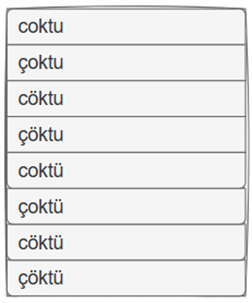
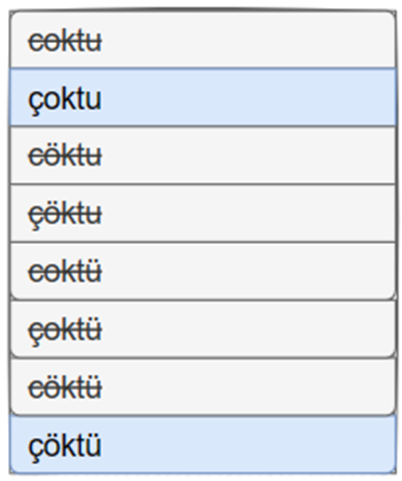
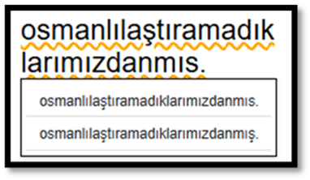
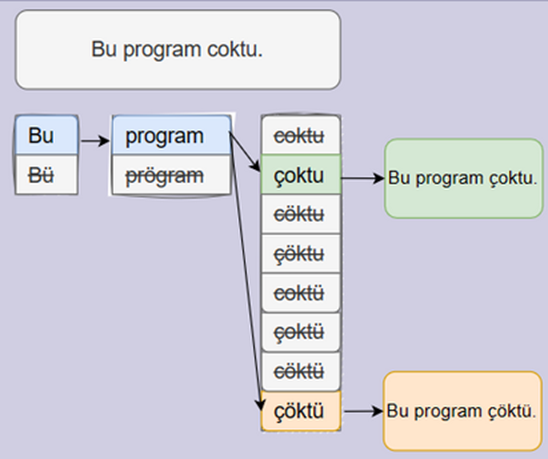
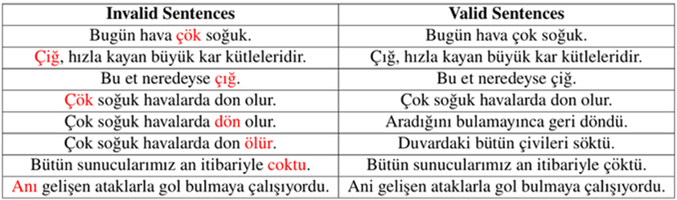
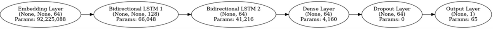
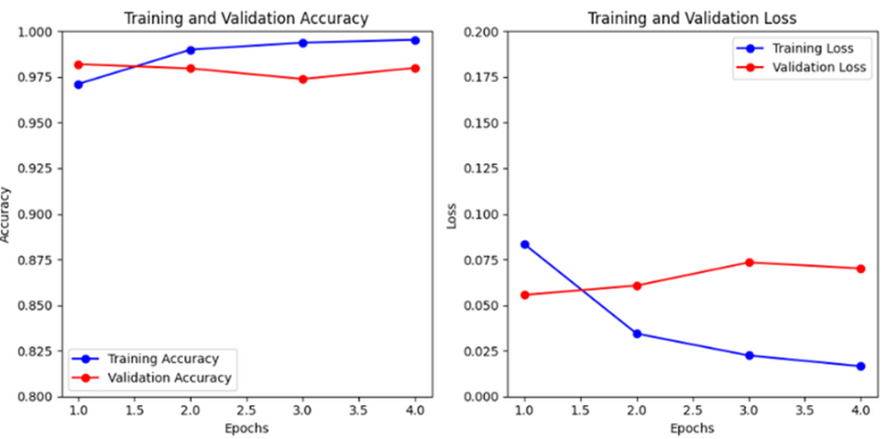
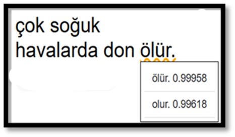

## Project Description
    This project aims to create a browser extension that corrects Turkish text typed using an English keyboard. The Turkish alphabet contains additional letters compared to the English alphabet, leading to multiple Turkish equivalents for some English letters. For instance, the English letter 'c' can correspond to both 'c' and 'ç' in the Turkish alphabet. Therefore, to generate accurate corrections, multiple variations of the typed word must be created by substituting letters with their Turkish equivalents.

     
    
    However, generating variations results in 2^n new words, where n is the number of letters in the word that have multiple equivalents. As n increases, processing these variations becomes increasingly difficult. To manage this, some of the generated words are eliminated through a dictionary lookup, ensuring that only valid Turkish words are considered. 
    
    

    Additionally, due to the nature of the Turkish language, it is challenging to cover all words using a dictionary alone. Therefore, major and minor vowel harmonies are implemented to aid in the elimination process.

    

    After the elimination of invalid words, the remaining variations are combined to form sentences. This process may result in one or many sentences.
    
    

    If only one sentence is formed, it is considered the correct sentence. However, if multiple sentences are formed, the correct one must be chosen wisely using a deep learning model.

    The deep learning model must select one of the sentences as the correct one. To achieve this, a dataset is created by extracting texts from the Turkish Wikipedia dump and splitting them into valid sentences. Since a binary classifier is required, invalid sentences are also needed. An invalid sentence is very similar to a valid sentence, except that one word is not valid in the context of the sentence. To train the deep learning model to distinguish valid sentences from invalid ones, it must be trained with sentences following this logic. Therefore, invalid sentences are created by replacing one of the words in a valid sentence with another valid Turkish variation of that word.

    

    A sequential deep learning model is created for this project, consisting of multiple layers:

    1. ** Embedding Layer ** : This layer tokenizes the words according to their frequency, which is necessary for transforming the words into a format suitable for processing by the neural network.
    2. ** Bidirectional LSTM Layers ** : These layers capture dependencies in the sentence, allowing the model to understand the context from both directions (past and future) within the sentence.
    3. ** Dense Layer ** : This layer has a positive effect on the accuracy of the deep learning model by enabling complex transformations and interactions within the data.
    4. ** Dropout Layer ** : This layer reduces overfitting by randomly setting a fraction of input units to 0 at each update during training time, which helps to prevent the model from relying too much on any particular set of features.

    

    After the deep learning model is created, it is trained with 3 million valid sentences and 3 million invalid sentences.

    

    The deep learning model is converted into TensorFlow.js format for use in the browser. Additionally, a user interface is created. When a user types a sentence ending with a punctuation mark ('!', '.', '?'), it automatically corrects each word. However, if the deep learning model is not confident about a word (with a prediction score difference of two sentences are less than 0.1), it underlines the word in orange and provides alternative options for the user to select when they right-click on it.

    

## Files and Folders

    1. ** finalDL ** : Contains TensorFlow.js format of the deep learning model.
    2. ** pictures ** : Contains necessary pictures and video for readme file.
    3. ** presentations and report ** : Contains presentations and report of the project.
    4. ** deepLearningModel.ipynb ** : The code for creating and training the deep learning model.
    5. ** logo.png ** : The logo of the plugin.
    6. ** manifest.json ** : Manifest file of the plugin.
    7. ** tokens.txt ** : Contains words and their tokens.
    8. ** words.txt ** : Contains valid Turkish words.

## Preview

    
